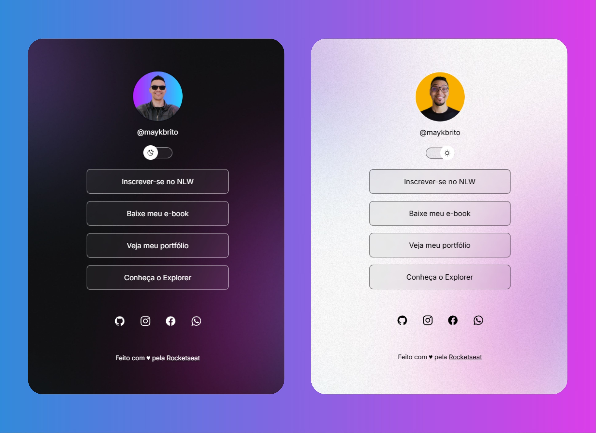

# Primeiro Projeto da Rocket Seat no curso *DISCOVER*.

Programa exclusivo e gratuito, promovido pela RocketSeat para ensino de tecnologias WEB.

## Tecnologias

Esse projeto foi desenvolvido com as seguintes tecnologias:

- HTML e CSS
- JavaScript
- Git e Github
- Figma

## Projeto

Esse projeto é um agregador de links para usar como cartão de visita online.

## Layout

Você pode visualizar o layout do projeto atravé [DESSE LINK](https://www.figma.com/design/aSSrD3Raed3SfBGnwmf6UX/DevLinks-%E2%80%A2-Projeto-Discover-(Community)?node-id=10-620&p=f&t=9jLWpGGpTX9YiChx-0). É necessário ter conta no [Figma](https://figma.com) para acessá-lo.

## Licença

Esse projeto está sob a licença MIT.

---

Feito com ♥ pela Rocketseat. [Participe da nossa comunidade!](https://discord.gg/rocketseat)
